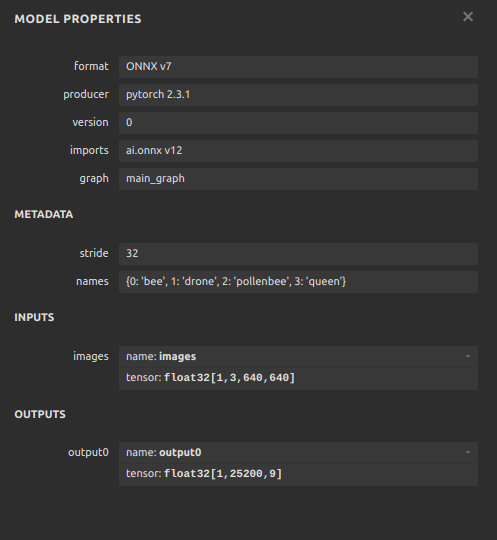
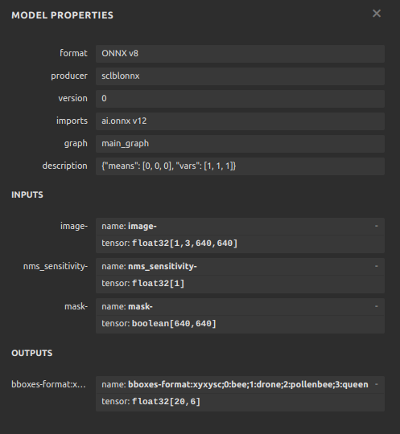

# Yolov5 to ONNX

This guide walks you through the process of exporting a model from Yolov5 to ONNX format. The model is then used to
perform inference on a sample image.

Yolov5 models are usually available as `.pt` files. They are exported to ONNX using the `export.py` script provided in
the Yolov5 repository.   
The generated ONNX file outputs proposed bounding boxes that need to be post-processed by non-maximum suppression (NMS)
to get the final pertinent bounding boxes, and discard the rest. That post-processing is included the ONNX file by
running the `complete-onnx.py` script. Additionally, the script adds two inputs to the model:`nms_sensitivity-` and `mask-` 
and renames the model's inputs and outputs to match the Nx AI Manager's requirements.

## Getting started

For the sake of example, we will be using this trained [bee detection model](https://github.com/mattnudi/bee-detection).
The model checkpoint is available in this folder as: [bee.pt](bee-model.pt).

Now, let's convert the model to ONNX format.

### Step 1: Install Python requirements

```bash
pip install -r requirements.txt
```

### Step 2: Clone the Yolov5 repository

```bash
git clone https://github.com/ultralytics/yolov5.git
cd yolov5
pip install -r requirements.txt
```

### Step 3: Export the model to ONNX

```bash
python export.py --weights ../bee-model.pt --img 640 --batch 1 --opset 12 --include onnx 
```

### Step 4: Add post-processing to the model and rename its I/O

```bash
cd ..
python complete_onnx.py --model ./yolov5/bee-model.onnx
```

### Step 5: Run inference on a sample image

```bash
python test_onnx.py
```

### Step 6: Visualize the model using Netron

```bash
pip install netron
netron ./yolov5/bee-model-complete.onnx # To visualize the complete model
netron ./yolov5/bee-model.onnx          # To visualize the original model
```
#### This is how the ONNX model when exported by Yolov5 looks like in Netron:


#### And this is how the model looks like after post-processing and renaming its I/O:


### Step 6: Deploy the model

The generated ONNX file (file with `-complete.onnx` extension) can now be uploaded in the Nx AI Cloud for deployment.


## All in one

The [yolov5-to-onnx.sh](yolov5-to-onnx.sh) script automates the above steps. You can run it as follows:

```bash
bash yolov5-to-onnx.sh
```